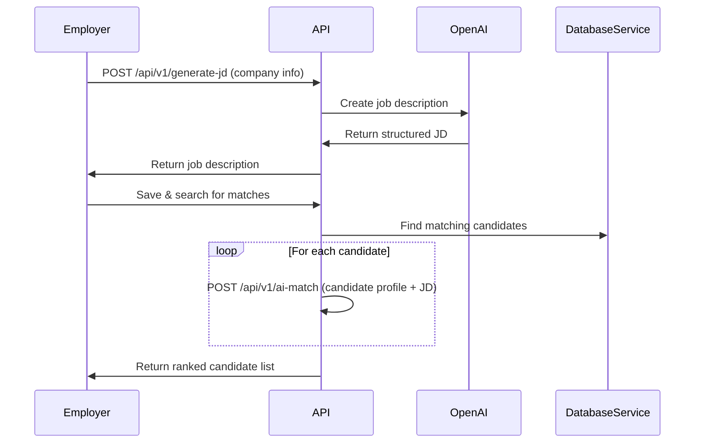
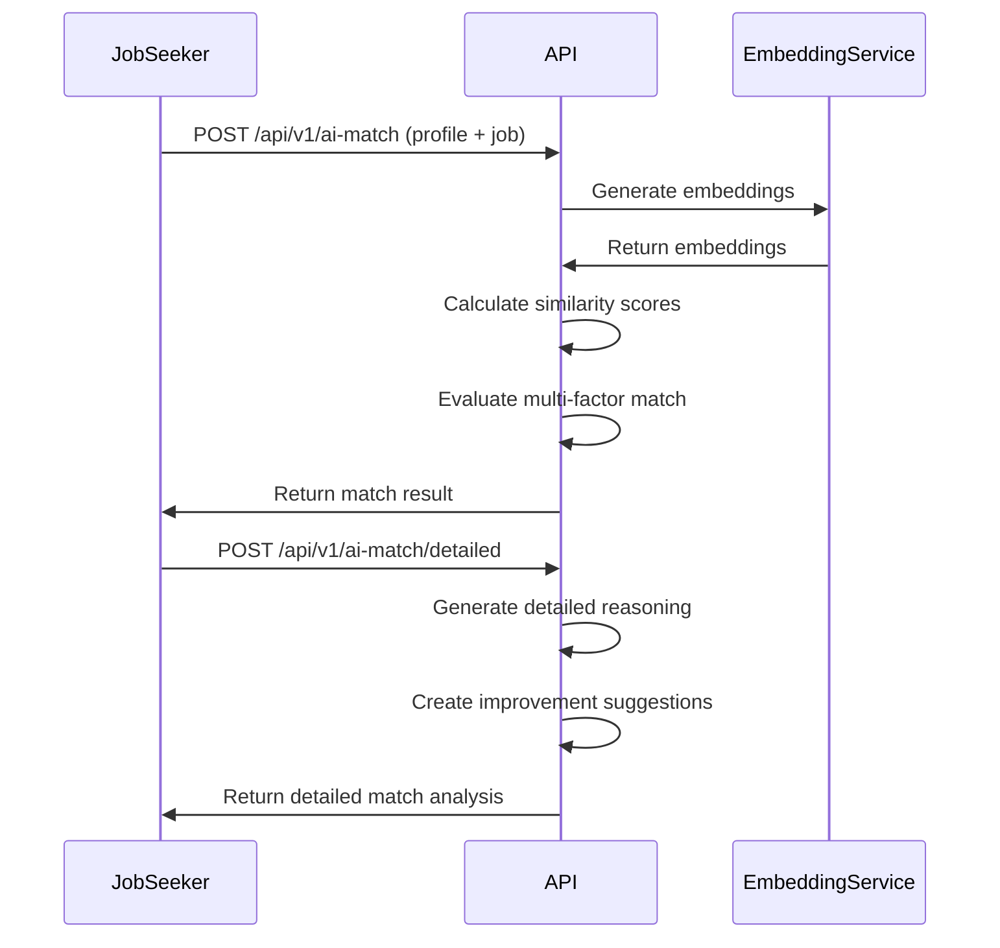
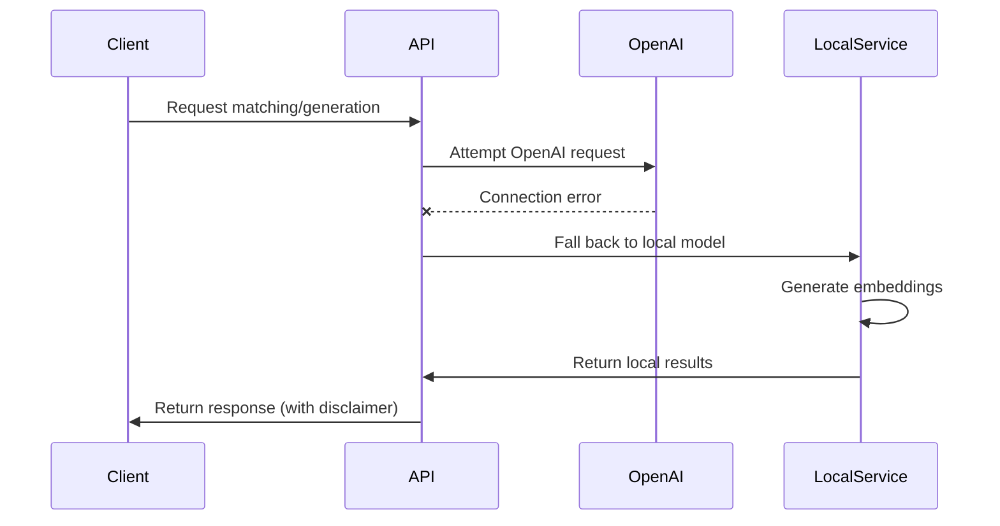

# Unified Job Matching API

A streamlined API for Problem generation and matching user profiles with job requirements using AI techniques.

## Features

- **Job Description Generation**: AI-powered generation of job descriptions based on employer data
- **AI-Powered Matching**: Uses embeddings to understand the semantic relationship between skills and requirements
- **Multi-Dimensional Analysis**: Evaluates candidates across skills, experience, and field relevance
- **Simple API Response**: Returns essential match information including match percentage and category details

## Architecture

```
┌─────────────────┐     ┌───────────────────┐     ┌──────────────────┐
│                 │     │                   │     │                  │
│  Client Apps    │◄────┤  Unified API      │◄────┤  OpenAI API      │
│  (Frontend)     │     │  (FastAPI)        │     │  (GPT & Ada)     │
│                 │     │                   │     │                  │
└─────────────────┘     └───────────────────┘     └──────────────────┘
                               │
                          ┌────┴───────┐
                          │            │
                          ▼            ▼
               ┌─────────────────┐  ┌──────────────────┐
               │                 │  │                  │
               │ Job Description │  │ Profile Matching │
               │ Generation      │  │ Algorithm        │
               │                 │  │                  │
               └─────────────────┘  └──────────────────┘
                                          │
                                     ┌────┴───────┐
                                     │            │
                                     ▼            ▼
                          ┌─────────────────┐  ┌──────────────────┐
                          │                 │  │                  │
                          │ Embedding       │  │ Local Fallback   │
                          │ Service (OpenAI)│  │ (SentenceTransf.)│
                          │                 │  │                  │
                          └─────────────────┘  └──────────────────┘
```

## System Design

The system uses a combination of NLP techniques to achieve accurate job matching:

1. **Text Embeddings**: Converts user skills and job requirements into vector representations
2. **Semantic Matching**: Determines similarity between skill descriptions using cosine similarity
3. **Multi-factor Analysis**: Evaluates match across different categories (skills, field, experience)
4. **Fallback Mechanisms**: Uses local models when OpenAI is unavailable

## Project Structure

```
.
├── models/                # Data models
│   └── models.py          # Pydantic models for API requests/responses
├── routers/               # API route definitions
│   └── api_router.py      # Endpoint definitions
├── services/              # Business logic
│   ├── embedding_service.py  # Text embedding services
│   └── unified_service.py    # Job matching logic
├── .env                   # Environment variables (OpenAI API key)
├── main.py                # FastAPI application setup
├── run.py                 # Application entry point
├── requirements.txt       # Python dependencies
└── README.md              # This file
```

## Setup

1.
```bash
cd matching
```

2. Create a virtual environment and activate it:
```bash
python -m venv venv
source venv/bin/activate  # On Windows: venv\Scripts\activate
```

3. Install dependencies:
```bash
pip install -r requirements.txt
```

4. Set up environment variables:
```bash
# Create a .env file with your OpenAI API key
echo "OPENAI_API_KEY=your_api_key_here" > .env
```

5. Run the application:
```bash
python run.py
```

The API will be available at http://localhost:8000.

## API Documentation

### Base Endpoints

| Endpoint | Method | Description |
|----------|--------|-------------|
| `/` | GET | Welcome page for the API |
| `/health` | GET | Health check endpoint |
| `/docs` | GET | Swagger/OpenAPI documentation |

### Problems Generation

#### `POST /api/v1/generate-jd`

Generates a job description based on employer information using OpenAI.

**Request Body:**
```json
{
  "user": {
    "companyName": "TechSolutions Inc.",
    "companySize": "Medium",
    "noOfEmployees": 75,
    "companyType": "Software Development",
    "categories": ["Data Science", "Machine Learning"],
    "skills": ["Python", "TensorFlow", "Data Analysis", "SQL"],
    "problems": ["Inefficient data processing", "Manual data classification"],
    "businessData": ["Customer behavior data", "Transaction logs", "Product usage metrics"],
    "challengesFaced": ["Data silos", "Scaling ML models"],
    "dataAnalysisTools": ["Tableau", "Jupyter Notebooks", "Pandas"],
    "expectedOutcome": ["Automated classification system", "Improved user recommendations"]
  }
}
```

**Response:**
```json
{
  "problem": {
    "payRange": {
      "min": 80000,
      "max": 120000
    },
    "fellowField": "Data Science",
    "type": ["Machine Learning Engineer", "Data Scientist", "AI Developer"],
    "skills": ["Python", "TensorFlow", "SQL", "Machine Learning", "Data Analysis"],
    "description": "TechSolutions Inc. is seeking a talented Machine Learning Engineer to join our growing team. The successful candidate will develop and implement machine learning models to solve complex data processing challenges and automate classification systems...",
    "candidatesQualification": "Bachelor's degree in Computer Science, Data Science, or related field. Minimum 3 years of experience with Python, TensorFlow, and building production-ready ML models...",
    "niceToHaves": "Experience with cloud ML platforms (AWS SageMaker, Azure ML), knowledge of CI/CD pipelines for ML systems, and experience with real-time data processing systems..."
  }
}
```

### Profile Matching

#### `POST /api/v1/ai-match`

Matches a user profile against a job description using AI. Returns a simplified result.

**Request Body:**
```json
{
  "user_data": {
    "status": "OK",
    "user": {
      "_id": "user123",
      "firstName": "John",
      "lastName": "Doe",
      "email": "john.doe@example.com",
      "verified": true,
      "active": true,
      "skills": ["Python", "Data Analysis", "SQL", "Pandas"],
      "categories": ["Data Science"],
      "specialities": ["Data Visualization"],
      "categoriesAndSpecialitiesAdded": true,
      "workExperience": [
        {
          "_id": "exp1",
          "title": "Data Analyst",
          "company": "Analytics Corp",
          "location": "Remote",
          "startDate": "2020-01-15T00:00:00.000Z",
          "endDate": "2022-06-30T00:00:00.000Z",
          "description": "Performed data analysis and created visualizations for business stakeholders"
        }
      ],
      "educationHistory": [
        {
          "_id": "edu1",
          "school": "University of Technology",
          "degree": "Bachelor's",
          "fieldOfStudy": "Computer Science",
          "startDate": "2016-09-01T00:00:00.000Z",
          "endDate": "2020-05-30T00:00:00.000Z",
          "description": "Focused on data science and machine learning"
        }
      ],
      "skillsAdded": true,
      "workExperienceAdded": true,
      "educationHistoryAdded": true,
      "bio": "Data professional with 2+ years of experience in analytics and visualization",
      "bioAdded": true,
      "onboarded": true,
      "profileCompletion": 95,
      "userType": "jobseeker"
    }
  },
  "problem": {
    "payRange": {
      "min": 80000,
      "max": 120000
    },
    "fellowField": "Data Science",
    "type": ["Machine Learning Engineer", "Data Scientist"],
    "skills": ["Python", "TensorFlow", "SQL", "Machine Learning", "Data Analysis"],
    "description": "We are seeking a talented Data Scientist to build machine learning models...",
    "candidatesQualification": "Bachelor's degree in Computer Science or related field, 3+ years of experience...",
    "niceToHaves": "Experience with cloud platforms, knowledge of deep learning frameworks..."
  }
}
```

**Response:**
```json
{
  "percentage_match": 72,
  "what_matched": ["Skills", "Field"],
  "went_against": ["Experience"]
}
```

#### `POST /api/v1/ai-match/detailed`

Returns detailed matching information with reasoning and suggestions.

**Request Body:** Same as `/api/v1/ai-match`

**Response:**
```json
{
  "percentage_match": 72,
  "what_matched": ["Skills", "Field"],
  "went_against": ["Experience"],
  "detailed_reasoning": [
    {
      "feature": "Skills",
      "score": 0.85,
      "explanation": "The candidate has 4 out of 5 required skills (Python, SQL, Data Analysis)",
      "details": {
        "matching_skills": ["Python", "SQL", "Data Analysis"],
        "missing_skills": ["TensorFlow", "Machine Learning"]
      }
    },
    {
      "feature": "Field",
      "score": 0.95,
      "explanation": "The candidate's field matches the job's required field perfectly",
      "details": {
        "user_fields": ["Data Science"],
        "job_field": "Data Science",
        "specialities_bonus": true
      }
    },
    {
      "feature": "Experience",
      "score": 0.45,
      "explanation": "The job requires 3+ years experience but the candidate has only 2 years",
      "details": {
        "required_years": 3,
        "candidate_years": 2,
        "title_match_score": 0.7
      }
    }
  ],
  "suggested_improvements": [
    "Gain experience with TensorFlow and Machine Learning frameworks",
    "Consider pursuing additional experience in a Data Scientist role"
  ],
  "semantic_similarity": 0.78,
  "compatibility_by_area": {
    "Skills": 0.85,
    "Field": 0.95,
    "Experience": 0.45,
    "Education": 0.75,
    "Job Type": 0.8
  }
}
```

## Common Workflows

### 1. Generate Job Description & Find Matching Candidates



### 2. Assess Candidate-Job Compatibility



### 3. Fallback Flow When OpenAI Is Unavailable



## Environment Variables

| Variable | Description | Required |
|----------|-------------|----------|
| `OPENAI_API_KEY` | OpenAI API key for embeddings and completions | Yes |
| `PORT` | Port for the FastAPI server (default: 8000) | No |
| `LOG_LEVEL` | Logging level (default: INFO) | No |

## Acknowledgements

This API uses the following open-source libraries:
- FastAPI: High-performance web framework
- Pydantic: Data validation and settings management
- OpenAI API: Embeddings and completions
- SentenceTransformers: Local embedding model
- Scikit-learn: For similarity calculations and TF-IDF
