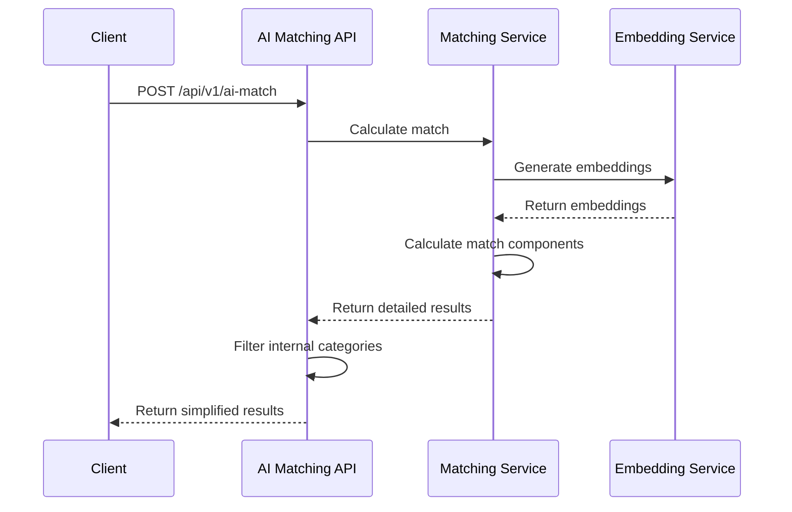
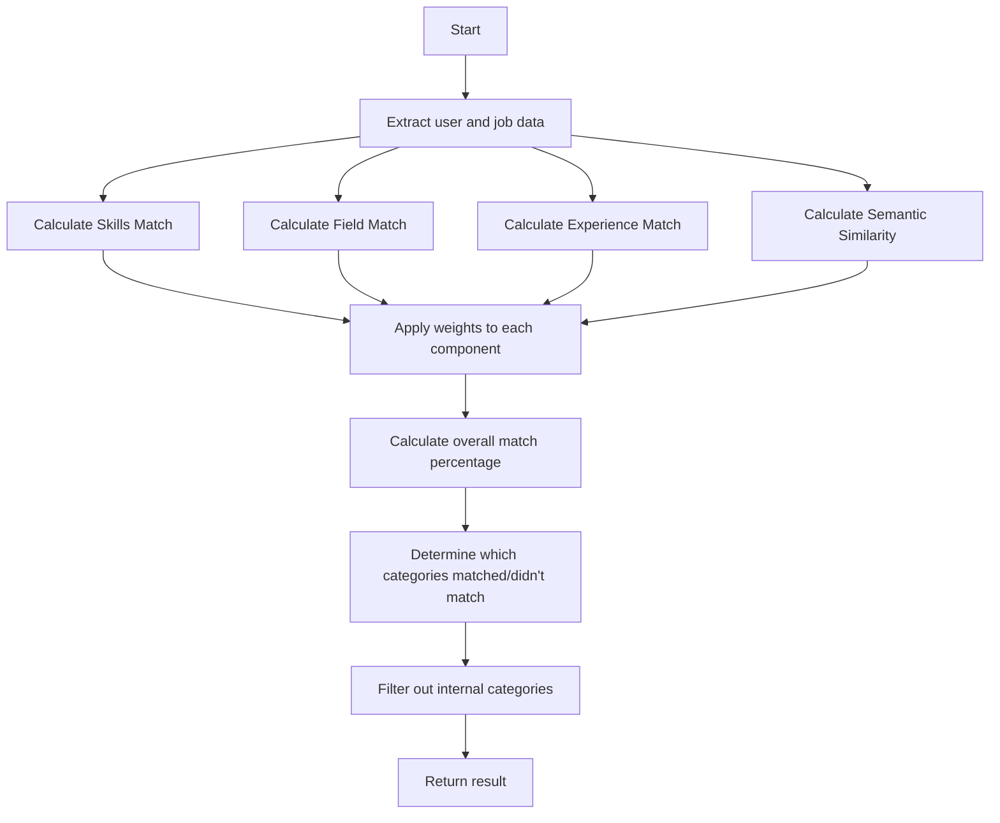

# AI-Powered Job Matching API

A sophisticated API service that evaluates candidates against job descriptions using advanced AI techniques to provide accurate matching scores and insights.


## Table of Contents
- [Features](#features)
- [Architecture](#architecture)
- [Installation](#installation)
- [Configuration](#configuration)
- [API Documentation](#api-documentation)
- [Common Workflows](#common-workflows)
- [Troubleshooting](#troubleshooting)
- [Contributing](#contributing)

## Features

- **AI-Powered Matching**: Leverages embeddings to understand the semantic relationship between skills and requirements
- **Multi-Dimensional Analysis**: Evaluates candidates across multiple dimensions including skills, experience, field relevance
- **Simplified Response Format**: Returns just the essential match details:
  - Match percentage
  - What matched (categories that were a good fit)
  - What went against (categories that weren't a good fit)
- **Fault Tolerance**: Falls back to simpler matching methods if more advanced techniques aren't available

## Architecture

The system employs a multi-layered architecture to provide comprehensive matching:


### Components

1. **API Layer**:
   - Receives requests and validates input
   - Handles error responses
   - Formats and filters output

2. **Matching Service Layer**:
   - Orchestrates the matching process
   - Coordinates between different matching components
   - Calculates overall match scores

3. **Embedding Service**:
   - Generates text embeddings for semantic comparison
   - Calculates similarity between text inputs
   - Fallback mechanisms for when external API services are unavailable

4. **Match Result Generation**:
   - Formats and filters the results
   - Ensures only user-facing categories are displayed

## Installation

### Prerequisites
- Python 3.8 or higher
- pip (Python package manager)
- A virtual environment tool like venv or conda

### Setup

1. 
```bash
cd ai_matching
```

2. Create a virtual environment:
```bash
python -m venv venv
source venv/bin/activate  # On Windows: venv\Scripts\activate
```

3. Install dependencies:
```bash
pip install -r requirements.txt
```

4. Set up environment variables:

Edit the `.env` file to add your OpenAI API key.

## Configuration

The application can be configured through the `.env` file:

```
# API Configuration

# OpenAI Configuration
OPENAI_API_KEY=your_openai_api_key_here
```

5. Run
```
uvicorn app.main:app --reload
```


## API Documentation

### Endpoints

#### `POST /api/v1/ai-match`

Matches a user profile against a job description using AI techniques.

**Request**

```json
{
  "user_data": {
    "status": "OK",
    "user": {
      "_id": "6057cfd8cc42f31212222111",
      "firstName": "Jane",
      "lastName": "Smith",
      "email": "jane.smith@example.com",
      "verified": true,
      "active": true,
      "categories": ["Quantitative Analyst (Quant)"],
      "specialities": ["Statistical Analysis"],
      "skills": [
        "Python",
        "R",
        "SQL",
        "Statistical Analysis",
        "Financial Modeling"
      ],
      "workExperience": [
        {
          "company": "Goldman Sachs",
          "title": "Associate Quantitative Analyst",
          "description": "Developed financial models",
          "startDate": "2022-01-01",
          "endDate": "2023-05-01",
          "location": "New York, NY"
        }
      ],
      "categoriesAndSpecialitiesAdded": true,
      "educationHistory": [],
      "skillsAdded": true,
      "workExperienceAdded": true,
      "educationHistoryAdded": true,
      "bio": "Experienced analyst",
      "bioAdded": true,
      "onboarded": true,
      "profileCompletion": 100,
      "userType": "fellow",
      "level": "Mid-level"
    }
  },
  "problem": {
    "payRange": {
      "min": 5000,
      "max": 10000
    },
    "_id": "67e3a4d9e2e076e069d7dc8a",
    "fellowField": "Quantitative Analysis",
    "type": [
      "Financial Modeling",
      "Risk Assessment"
    ],
    "skills": [
      "Structured Thinking",
      "SQL & Databases",
      "Business Acumen",
      "ETL"
    ],
    "description": "We need a solution to address inaccurate financial risk assessments.",
    "candidatesQualification": "Experience in financial modeling and risk assessment.",
    "niceToHaves": "Experience with quantitative analysis tools."
  }
}
```

**Response**

```json
{
  "percentage_match": 75,
  "what_matched": [
    "Skills",
    "Field"
  ],
  "went_against": [
    "Experience"
  ]
}
```

### Status Codes

- `200 OK`: Request successful
- `400 Bad Request`: Invalid input
- `422 Unprocessable Entity`: Missing required fields
- `500 Internal Server Error`: Server error

## Common Workflows

### 1. Basic Job Matching Flow



### 2. Matching Algorithm Flow



### 3. Example: Finding Matches for a Job

1. Create a POST request to `/api/v1/ai-match` with the user profile and job problem data
2. The system calculates match scores across multiple dimensions
3. The API returns a simplified response with match percentage and categories

## Troubleshooting

### Common Issues

1. **Missing User Fields**
   - Error: `422 Unprocessable Entity`
   - Solution: Ensure all required user fields are present in the request

2. **Server Error**
   - Error: `500 Internal Server Error`
   - Solution: Check the logs for more details

### Debugging

To enable debug logs, set `DEBUG=True` in your `.env` file.