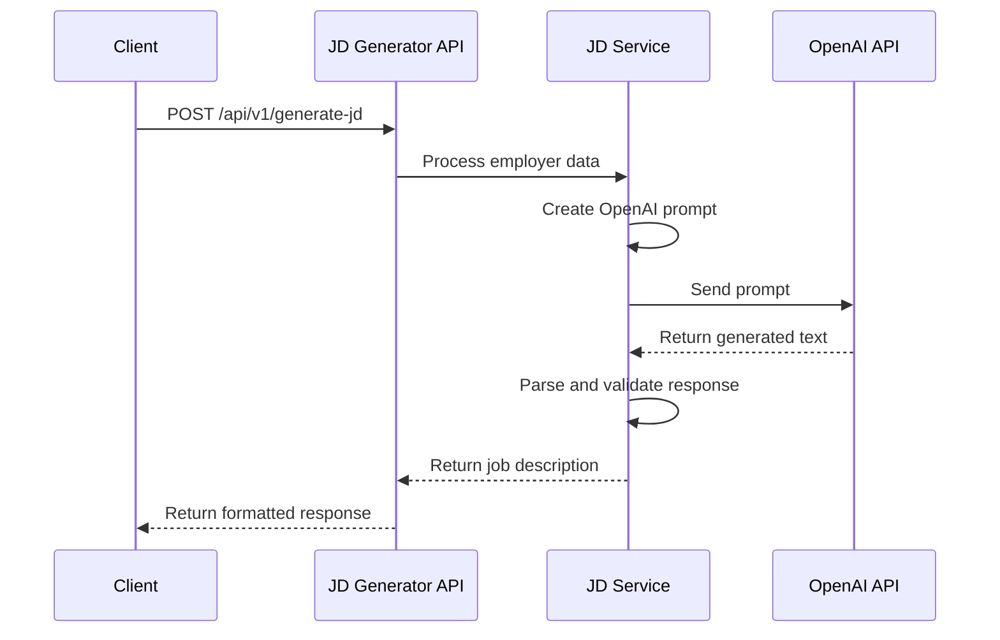
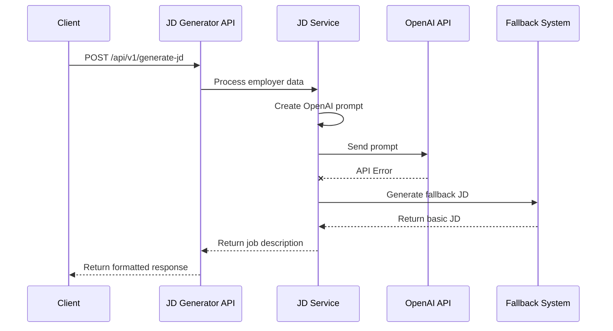

# JD Generator API

An intelligent API service that automatically generates job descriptions based on employer information using OpenAI.


## Table of Contents
- [Overview](#overview)
- [Features](#features)
- [Architecture](#architecture)
- [Installation](#installation)
- [Configuration](#configuration)
- [API Documentation](#api-documentation)
- [Common Workflows](#common-workflows)
- [Troubleshooting](#troubleshooting)
- [Contributing](#contributing)

## Overview

The JD Generator API transforms employer information into comprehensive, tailored job descriptions. It leverages OpenAI to generate professional job descriptions that match company needs, business challenges, and required skills.

## Features

- **AI-Powered JD Creation**: Uses OpenAI to generate intelligent, contextually appropriate job descriptions
- **Natural Language Processing**: Creates professional-quality job descriptions tailored to the company's needs
- **Structured Output**: Generates complete job descriptions with consistent formatting
- **Contextual Understanding**: Incorporates business problems and challenges into relevant job requirements
- **Fallback Mechanisms**: Includes rule-based fallbacks if AI generation fails

## Architecture

The system employs a layered architecture to generate comprehensive job descriptions:


### Components

1. **API Layer**:
   - Receives employer information
   - Validates input data
   - Returns formatted job descriptions

2. **OpenAI Integration**:
   - Crafts detailed prompts based on employer data
   - Processes GPT responses into structured job descriptions
   - Handles error cases and response validation

3. **Fallback System**:
   - Provides rule-based JD generation when OpenAI is unavailable
   - Ensures service reliability even when external services fail

4. **Output Formatting**:
   - Ensures consistent JSON structure
   - Validates all required fields are present

## Installation

### Prerequisites
- Python 3.8 or higher
- pip (Python package manager)
- An OpenAI API key
- A virtual environment tool like venv or conda

### Setup

1. Clone the repository:
```bash
git clone <repository-url>
cd jd_generator
```

2. Create a virtual environment:
```bash
python -m venv venv
source venv/bin/activate  # On Windows: venv\Scripts\activate
```

3. Install dependencies:
```bash
pip install -r requirements.txt
```

4. Set up environment variables:

Edit the `.env` file to add your OpenAI API key.

## Configuration

The application can be configured through the `.env` file:

```
# API Configuration

# OpenAI Configuration
OPENAI_API_KEY=your_openai_api_key_here
```

5. Run
```
uvicorn app.main:app --reload
```

## API Documentation

### Endpoints

#### `POST /api/v1/generate-jd`

Generates a job description based on employer information.

**Request**

```json
{
  "status": "OK",
  "user": {
    "_id": "67d760d5994d53ce79626804",
    "email": "employer@company.com",
    "verified": true,
    "active": true,
    "skills": [
      "Structured Thinking",
      "SQL & Databases",
      "Business Acumen",
      "ETL"
    ],
    "categories": [
      "Quantitative Analyst (Quant)"
    ],
    "onboarded": true,
    "profileCompletion": 16.666666666666664,
    "userType": "employer",
    "companyName": "Data Fellows",
    "fullName": "Jane Smith",
    "problems": [
      "Inaccurate financial risk assessments.",
      "Difficulty in modeling complex financial instruments."
    ],
    "companySize": "5-9",
    "companyType": "Sole Proprietorship",
    "noOfEmployees": 75,
    "businessData": [
      "Sales",
      "Customer"
    ],
    "challengesFaced": [
      "Lack of expertise",
      "High cost of analytics tools"
    ],
    "dataAnalysisTools": [
      "Excel/Google Sheets",
      "Business Intelligence Software"
    ],
    "expectedOutcome": [
      "Improve sales performance",
      "Better understand customer behavior"
    ]
  }
}
```

**Response**

```json
{
  "problem": {
    "payRange": {
      "min": 5000,
      "max": 10000
    },
    "fellowField": "Quantitative Analysis",
    "type": [
      "Financial Modeling",
      "Risk Assessment"
    ],
    "skills": [
      "Structured Thinking",
      "SQL & Databases",
      "Business Acumen",
      "ETL",
      "Data Analysis"
    ],
    "description": "We need a solution to address inaccurate financial risk assessments and difficulties in modeling complex financial instruments. Our focus areas include sales and customer data. Our goals are to improve sales performance and better understand customer behavior.",
    "candidatesQualification": "Experience in quantitative analysis with focus on financial modeling and risk assessment. Strong skills in Structured Thinking, SQL & Databases, Business Acumen, and ETL.",
    "niceToHaves": "Experience with Excel/Google Sheets and Business Intelligence Software."
  }
}
```

### Response Structure

| Field | Type | Description |
|-------|------|-------------|
| problem | Object | Container for the job description |
| problem.payRange | Object | Salary range with min and max values |
| problem.fellowField | String | Primary field/category for the job |
| problem.type | Array | List of job types/specialties (2-3 items) |
| problem.skills | Array | Required skills (4-5 items) |
| problem.description | String | Detailed job description text |
| problem.candidatesQualification | String | Required qualifications text |
| problem.niceToHaves | String | Preferred qualifications text |

### Status Codes

- `200 OK`: Request successful
- `400 Bad Request`: Invalid input
- `500 Internal Server Error`: Server error, possibly with OpenAI

## Common Workflows

### 1. Basic JD Generation Flow



### 2. Fallback Flow (when OpenAI fails)



### 3. End-to-End Example: Creating a Job Post

1. Employer completes their profile with company details, business challenges, and skills needed
2. System sends a request to the JD Generator API with this information
3. API generates a complete job description using OpenAI
4. The generated JD is returned and can be used in job postings
5. Employer can review and post the job description

## Troubleshooting

### Common Issues

1. **OpenAI API Errors**
   - Error: `500 Internal Server Error` with OpenAI-related message
   - Solution: Check your API key and OpenAI service status

2. **Missing Required Fields**
   - Error: Invalid response format
   - Solution: Ensure all required employer fields are included

3. **Poor Quality Descriptions**
   - Issue: Generated descriptions lack detail or relevance
   - Solution: Consider upgrading to GPT-4 by changing the model in .env

### Debugging

To enable debug logs, set `DEBUG=True` in your `.env` file.